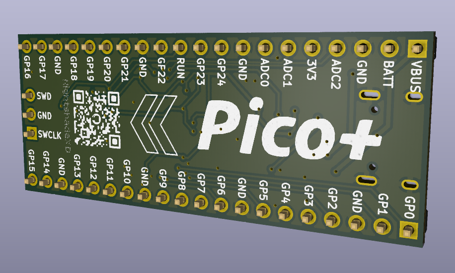
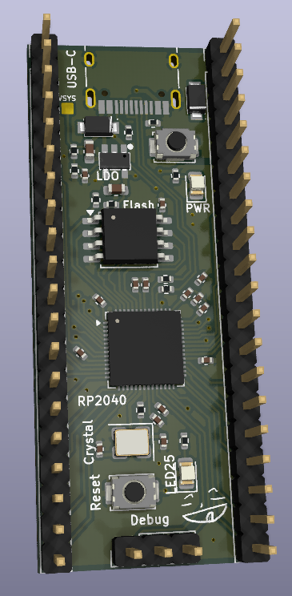

# Pico-Devboard

A custom rp2040 devboard, but with 16MB flash and a lot of extra features!

| Front Render                            | PCB                    |
| --------------------------------------- | ---------------------- |
|  |  |

## Motivation

I wanted a more capable RP2040 board with significantly more flash memory and USB-C. Most dev boards limit storage and input options, so I designed one that supports USB-C, battery input, higher current capability, and voltage monitoring while staying in the same form factor.

## Features

- RP2040 microcontroller
- 16MB QSPI Flash
- USB-C
- Battery input (Schottky diode OR-ing with USB)
- 500mA LDO (10V max input)
- VSYS voltage monitoring via resistor divider on ADC3
- Onboard power LED
- Onboard GPIO25 LED
- Bootsel + Reset button
- Fully labeled GPIO pins

## Future Improvements

- Buck-boost regulator for better efficiency + larger voltage range
- Exposed VSYS pin
- 3V3_EN pin breakout

## How to Use

Like a normal Pico:

1. Power the board via USB-C or VBAT input.
2. Flash firmware using BOOTSEL mode (or make your own)
3. Use onboard GPIO headers as you would with a standard Pico.

## BOM

A complete `BOM.csv` with direct links is provided in BOM.csv in the root directory.
| Designator | Comment | Footprint | Manufacturer | Part Number | JLCPCB Part # | Link | Qty | Total Price ($) |
|------------|----------|------------|--------------|-------------|----------------|------|-----|-----------------|
| C1, C4 | 1uF | 0402 | Samsung | CL05A105KA5NQNC | C52923 | https://jlcpcb.com/partdetail/53938-CL05A105KA5NQNC/C52923 | 10 | 0.033 |
| C9 | 1nF | 0402 | FH | 0402B102K500NT | C1523 | https://jlcpcb.com/partdetail/1875-0402B102K500NT/C1523 | 5 | 0.006 |
| C11, C8, C3, C10, C17, C5, C7, C6, C12, C2 | 0.1uF | 0402 | Samsung | CL05B104KO5NNNC | C1525 | https://jlcpcb.com/partdetail/1877-CL05B104KO5NNNC/C1525 | 50 | 0.065 |
| C14, C13 | 10uF | 0603 | Samsung | CL10A106KP8NNNC | C19702 | https://jlcpcb.com/partdetail/20411-CL10A106KP8NNNC/C19702 | 10 | 0.065 |
| C16, C15 | 33pF | 0402 | FH | 0402CG330J500NT | C1562 | https://jlcpcb.com/partdetail/1914-0402CG330J500NT/C1562 | 10 | 0.012 |
| D2, D1 | LED (Red 0805) | 0805 | NationStar | NCD0805R1 | C84256 | https://jlcpcb.com/partdetail/85425-NCD0805R1/C84256 | 10 | 0.131 |
| D4, D3 | FMBR120VLSFT1G | SOD-123FL | FUXINSEMI | FMBR120VLSFT1G | C48677824 | https://jlcpcb.com/partdetail/FUXINSEMI-FMBR120VLSFT1G/C48677824 | 14 | 1.0444 |
| J1 | USB-C 14P | SMD | Hroparts | TYPE-C-31-M-12 | C165948 | https://jlcpcb.com/partdetail/Korean_HropartsElec-TYPE_C_31_M12/C165948 | 5 | 0.9055 |
| R1, R2 | 5.1K | 0402 | UNI-ROYAL | 0402WGF5101TCE | C25905 | https://jlcpcb.com/partdetail/26648-0402WGF5101TCE/C25905 | 10 | 0.008 |
| R4, R3 | 27Ω | 0402 | UNI-ROYAL | 0402WGF270JTCE | C25100 | https://jlcpcb.com/partdetail/25843-0402WGF270JTCE/C25100 | 22 | 0.0154 |
| R7 | 10K | 0402 | UNI-ROYAL | 0402WGF1002TCE | C25744 | https://jlcpcb.com/partdetail/26487-0402WGF1002TCE/C25744 | 5 | 0.004 |
| R9, R8, R5, R6 | 1K | 0402 | UNI-ROYAL | 0402WGF1001TCE | C11702 | https://jlcpcb.com/partdetail/12256-0402WGF1001TCE/C11702 | 20 | 0.014 |
| R10 | 200K | 0402 | UNI-ROYAL | 0402WGF2003TCE | C25764 | https://jlcpcb.com/partdetail/26507-0402WGF2003TCE/C25764 | 5 | 0.0035 |
| R11 | 100K | 0402 | UNI-ROYAL | 0402WGF1003TCE | C25741 | https://jlcpcb.com/partdetail/26484-0402WGF1003TCE/C25741 | 5 | 0.004 |
| SW2, SW1 | Tactile Switch | 4x3mm SMD | XUNPU | TS-1088-AR02016 | C720477 | https://jlcpcb.com/partdetail/XUNPU-TS_1088AR02016/C720477 | 10 | 0.476 |
| U1 | RP2040 | LQFN-56 | Raspberry Pi | RP2040 | C2040 | https://jlcpcb.com/partdetail/RaspberryPi-RP2040/C2040 | 5 | 4.827 |
| U2 | TPSPX3819M5-L-3-3 | SOT-23-5 | TECH PUBLIC | TPSPX3819M5-L-3-3 | C5370980 | https://jlcpcb.com/partdetail/TECHPUBLIC-TPSPX3819M5_L_33/C5370980 | 7 | 0.6839 |
| U3 | W25Q128JVSIQ | SOIC-8-208mil | Winbond | W25Q128JVSIQ | C97521 | https://jlcpcb.com/partdetail/WinbondElec-W25Q128JVSIQ/C97521 | 5 | 11.637 |
| Y1 | 12MHz Crystal | SMD3225-4P | YXC | X322512MSB4SI | C9002 | https://jlcpcb.com/partdetail/YXC_CrystalOscillators-X322512MSB4SI/C9002 | 5 | 0.363 |
| J3, J2 | 1x20 Pin Header | P2.54mm | — | Not Selected | — | — | — | — |
| J4 | 1x03 Pin Header | P2.54mm | — | Not Selected | — | — | — | — |
